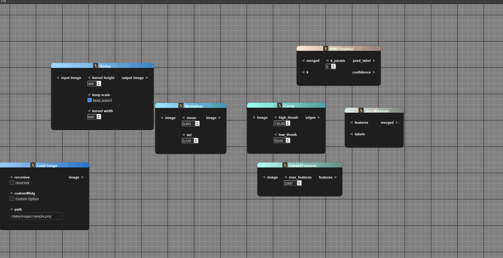

# NodeDataFlowEditor

NodeDataFlowEditor is a C++ node-based editor framework built with Qt, providing:

- Dynamic nodes with input, output, and parameter ports.
- Compile-time and runtime type-safe port tagging.
- Flexible node creation and port management.
- Scene, group, and connection utilities.
- Widget-based parameter integration with cloning and synchronization.
- Efficient tag-based filtering and connection validation.

---

## Features

### Node Management
- Create nodes with `NodeFactory`.
- Add input, output, and parameter ports dynamically.
- Set titles, colors, and positions.
- Show/hide nodes and ports in the scene.
- Modify the displayed names of nodes, inputs, outputs, and parameters.
- Connect and disconnect ports using `ConnectionItem`.

### Tag System
- Compile-time tags for type safety.
- Runtime lookup and application via `TagApplicator`.
- Taggable ports allow filtering, validation, and metadata propagation.
- Free functions for adding/removing/checking tags (`addTag`, `hasTag`, etc.).

### Scene Utilities
- Select nodes, groups, and connections.
- Generate glowing random colors for nodes.
- Calculate bounding boxes for groups.
- Safely delete nodes and connections.
- Iterate over selected items with callbacks.

### Parameter Widget Support
- Supports `QWidget`-based parameters.
- Clone and synchronize parameter widgets with `WidgetVisitor`.
- Works with `QSpinBox`, `QDoubleSpinBox`, `QSlider`, `QComboBox`, `QCheckBox`, `QRadioButton`, `QLineEdit`, `QTextEdit`, and more.

---

## Architecture Overview

```text
NodeDataFlowEditor
├─ NodeItem
│  ├─ Input Ports (PortLabel)
│  ├─ Output Ports (PortLabel)
│  └─ Parameter Ports (PortLabel + QWidget)
├─ ConnectionItem (connects PortLabel ↔ PortLabel)
├─ GraphScene (manages nodes & connections)
├─ GraphView (visual representation)
├─ NodeFactory (creates & manages nodes)
├─ Taggable / TagRegistry / TagApplicator (compile-time & runtime tags)
└─ WidgetVisitor (clones & synchronizes QWidget parameters)
```

---

## Installation

1. Include the library headers in your Qt project.
2. Link against Qt5/6 modules: `Core`, `Widgets`, `Gui`.
3. Link against `gtest`.
4. Ensure C++17 (or later) support.

---

## Usage

### Initialize Scene and Tag System

```cpp
// some tags
namespace data
{
    struct ImageType
    {};
    template <typename T>
    struct ValueWrapper
    {};
} // namespace data
```
```cpp
// Register all tag types eg:
TagApplicator::MultiTagRegistrar<
    data::ImageType,
    data::ValueWrapper<int>,
    data::ValueWrapper<double>,
    data::ValueWrapper<float>,
    data::ValueWrapper<std::string>
> registerDataTags;

// Initialize scene and view
auto m_scene = new GraphScene(this);
auto m_view = new GraphView(m_scene, this);
```

### Create a Node

```cpp
auto nOverlay = m_scene->getNodeFactory()->createNode(
    m_scene,
    "Overlay",
    QColor(200, 145, 140),
    QPointF(1760, 60)
);
```

### Add Input and Output Ports with Tags

```cpp
// Input ports
m_scene->getNodeFactory()->addInput(*nOverlay, "image");
m_scene->getNodeFactory()->addInputTag<data::ImageType>(*nOverlay, "image");

m_scene->getNodeFactory()->addInput(*nOverlay, "edges");
m_scene->getNodeFactory()->addInputTag<data::ImageType>(*nOverlay, "edges");

m_scene->getNodeFactory()->addInput(*nOverlay, "label");
m_scene->getNodeFactory()->addInputTag<data::ValueWrapper<int>>(*nOverlay, "label");

// Output port
m_scene->getNodeFactory()->addOutput(*nOverlay, "image");
m_scene->getNodeFactory()->addOutputTag<data::ImageType>(*nOverlay, "image");
```

### Add Parameter Widgets

```cpp
auto* alpha = new QDoubleSpinBox();
alpha->setRange(0.0, 1.0);
alpha->setDecimals(2);
alpha->setValue(0.5);

m_scene->getNodeFactory()->addParameter(*nOverlay, alpha, "alpha");
m_scene->getNodeFactory()->addParamTag<data::ValueWrapper<float>>(*nOverlay, "alpha");
```

---

## License

MIT License  

```
MIT License

Copyright (c) 2025 Your Name

Permission is hereby granted, free of charge, to any person obtaining a copy
of this software and associated documentation files (the "Software"), to deal
in the Software without restriction, including without limitation the rights
to use, copy, modify, merge, publish, distribute, sublicense, and/or sell
copies of the Software, and to permit persons to whom the Software is
furnished to do so, subject to the following conditions:

The above copyright notice and this permission notice shall be included in
all copies or substantial portions of the Software.

THE SOFTWARE IS PROVIDED "AS IS", WITHOUT WARRANTY OF ANY KIND, EXPRESS OR
IMPLIED, INCLUDING BUT NOT LIMITED TO THE WARRANTIES OF MERCHANTABILITY,
FITNESS FOR A PARTICULAR PURPOSE AND NONINFRINGEMENT. IN NO EVENT SHALL THE
AUTHORS OR COPYRIGHT HOLDERS BE LIABLE FOR ANY CLAIM, DAMAGES OR OTHER
LIABILITY, WHETHER IN AN ACTION OF CONTRACT, TORT OR OTHERWISE, ARISING FROM,
OUT OF OR IN CONNECTION WITH THE SOFTWARE OR THE USE OR OTHER DEALINGS IN
THE SOFTWARE.
```

